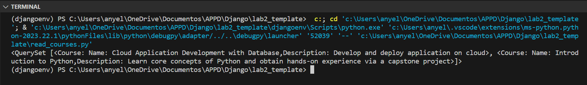

## Configuración de la Aplicación CRUD de Django

Esta guía proporciona instrucciones para configurar una aplicación de Django con operaciones CRUD. La aplicación incluye modelos para Learner, Instructor, Course, Lesson y Enrollment, lo que te permite gestionar aprendices, instructores, cursos y lecciones.

### **Seleccionar Idioma:**
- [Español](README-es.md)
- [Inglés](README.md)

## Resultado
### Leer Cursos
 
### Leer Aprendices
 
### Seleccionar Curso
 
### Seleccionar Aprendices
 


### Prerrequisitos

Asegúrate de tener instalados los siguientes elementos en tu máquina:

- [Docker](https://www.docker.com/get-started)
- [Python](https://www.python.org/downloads/)

### Dockerfile

Crea un Dockerfile en el directorio raíz de tu proyecto con el siguiente contenido:

```dockerfile
# Seleccionar la imagen base
FROM python:3.8

# Establecer el directorio de trabajo
WORKDIR /app

# Copiar archivos de la aplicación
COPY . /app

# Instalar dependencias
RUN pip install -r requirements.txt

# Aplicar migraciones de la base de datos
RUN python manage.py makemigrations
RUN python manage.py migrate

# Ejecutar la aplicación de Django
CMD ["python", "write.py"]
```

### Configuración de la Base de Datos (settings.py)

Asegúrate de que tu archivo `settings.py` incluya la configuración de la base de datos PostgreSQL:

```python
# PostgreSQL
DATABASES = {
    'default': {
        'ENGINE': 'django.db.backends.postgresql_psycopg2',
        'NAME': 'postgres',
        'USER': 'postgres',
        'PASSWORD': 'postgres',
        'HOST': 'localhost',
        'PORT': '5432',
    }
}
```

### write.py

Tu script `write.py` es responsable de poblar la base de datos con datos iniciales. Crea instancias de instructores, cursos, lecciones y aprendices. Asegúrate de que este script esté estructurado según tus necesidades.

### Ejecutar la Aplicación

Ejecuta los siguientes comandos en tu terminal:

```bash
# Construir la imagen de Docker
docker build -t django-crud-app .

# Ejecutar el contenedor de Docker
docker run -p 8000:8000 django-crud-app
```

Visita [http://localhost:8000](http://localhost:8000) en tu navegador web para interactuar con la aplicación de Django.

### Nota

- Asegúrate de reemplazar las dependencias reales de la aplicación Django en el archivo `requirements.txt`.
- Ajusta las credenciales de PostgreSQL en el archivo `settings.py` según la configuración de tu base de datos.
- Personaliza el script `write.py` según los requisitos específicos de carga inicial de datos.

Ahora tienes una aplicación Django CRUD con una configuración inicial de la base de datos. Pueden ser necesarios ajustes según la estructura del proyecto y el caso de uso específico.