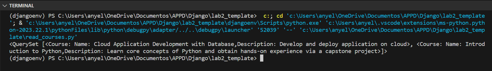

## Django CRUD Application Setup

This guide provides instructions on setting up a Django application with CRUD operations. The application includes models for Learner, Instructor, Course, Lesson, and Enrollment, allowing you to manage learners, instructors, courses, and lessons.


### **Select Language:**
- [Español (Spanish)](README-es.md)
- [English](README.md)

## Result
### Read Course
 
### Read Learners
 
### Select Course
 
### Select Learners
 


### Prerequisites

Make sure you have the following installed on your machine:

- [Docker](https://www.docker.com/get-started)
- [Python](https://www.python.org/downloads/)

### Dockerfile

Create a Dockerfile in your project's root directory with the following content:

```dockerfile
# Select the base image
FROM python:3.8

# Set the working directory
WORKDIR /app

# Copy application files
COPY . /app

# Install dependencies
RUN pip install -r requirements.txt

# Apply database migrations
RUN python manage.py makemigrations
RUN python manage.py migrate

# Run the Django application
CMD ["python", "write.py"]
```

### Database Configuration (settings.py)

Ensure your `settings.py` file includes the PostgreSQL database configuration:

```python
# PostgreSQL
DATABASES = {
    'default': {
        'ENGINE': 'django.db.backends.postgresql_psycopg2',
        'NAME': 'postgres',
        'USER': 'postgres',
        'PASSWORD': 'postgres',
        'HOST': 'localhost',
        'PORT': '5432',
    }
}
```

### write.py

Your `write.py` script is responsible for populating the database with initial data. It creates instances of instructors, courses, lessons, and learners. Ensure this script is structured as desired.

### Running the Application

Execute the following commands in your terminal:

```bash
# Build the Docker image
docker build -t django-crud-app .

# Run the Docker container
docker run -p 8000:8000 django-crud-app
```

Visit [http://localhost:8000](http://localhost:8000) in your web browser to interact with the Django application.

### Note

- Make sure to replace the Django application's actual dependencies in the `requirements.txt` file.
- Adjust the PostgreSQL credentials in the `settings.py` file based on your database configuration.
- Customize the `write.py` script for specific data seeding requirements.

Now you have a Django CRUD application with an initial database setup. Adjustments may be needed based on your project structure and specific use case.